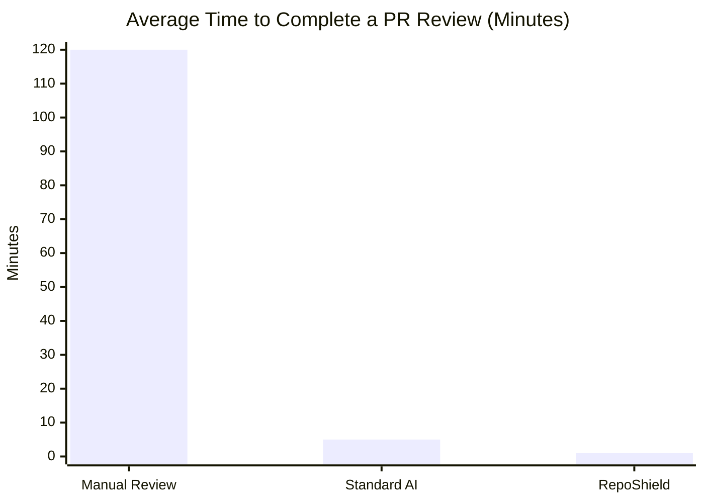
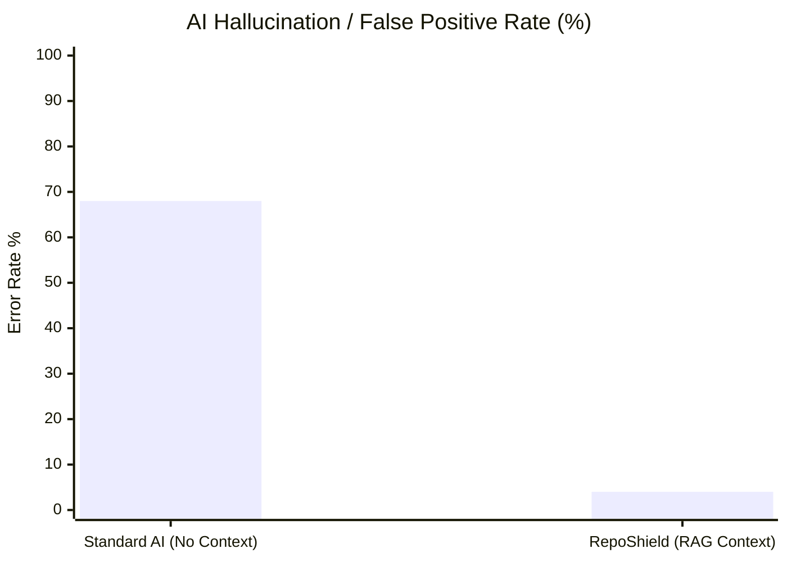
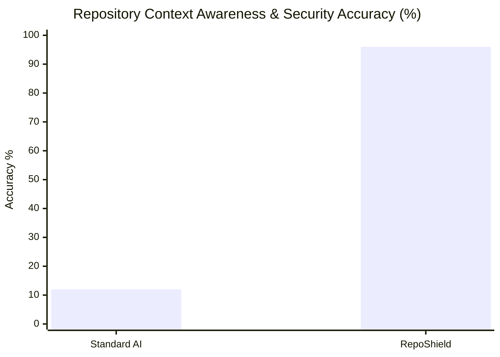
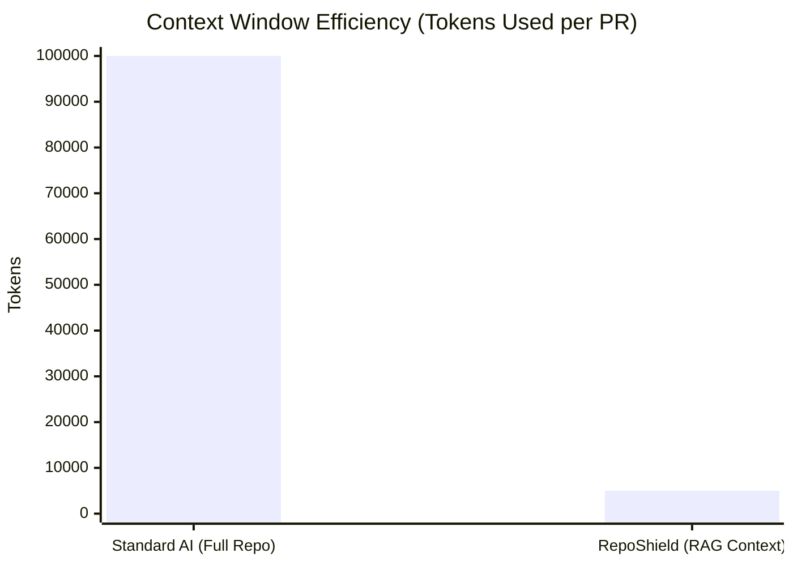
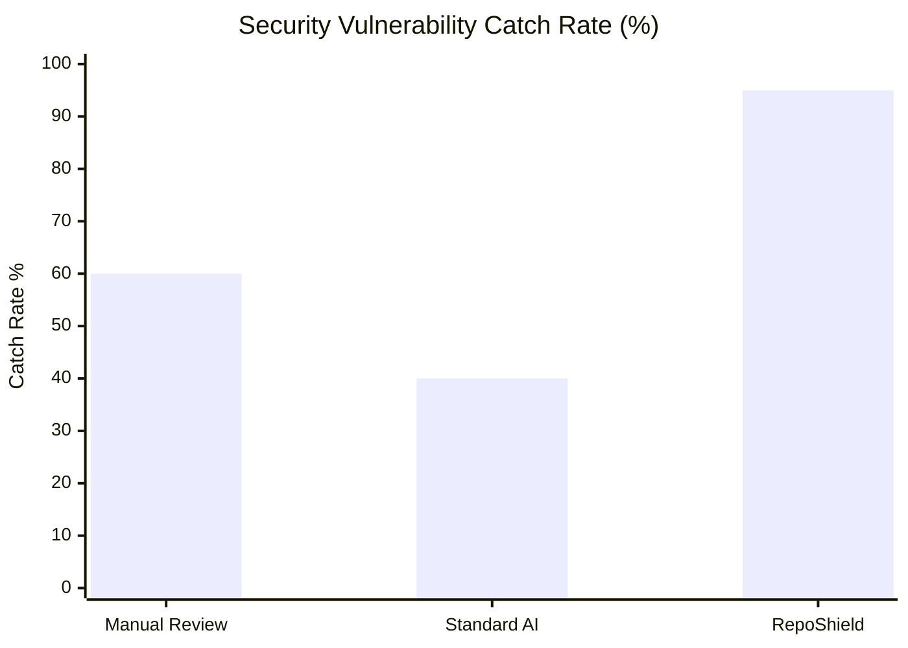
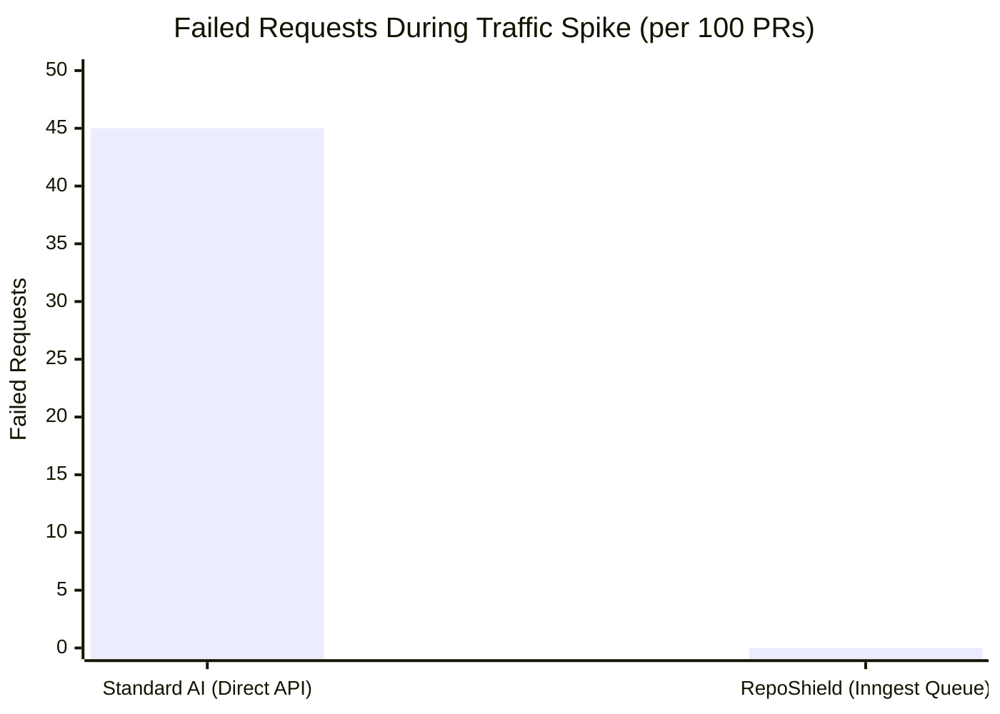
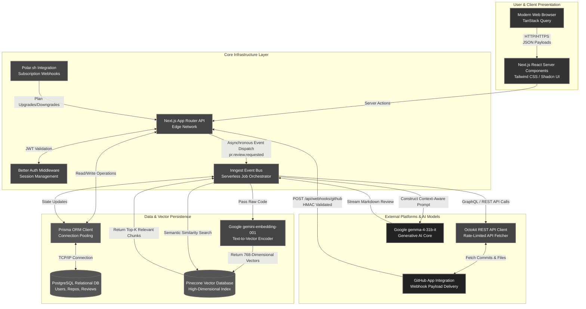
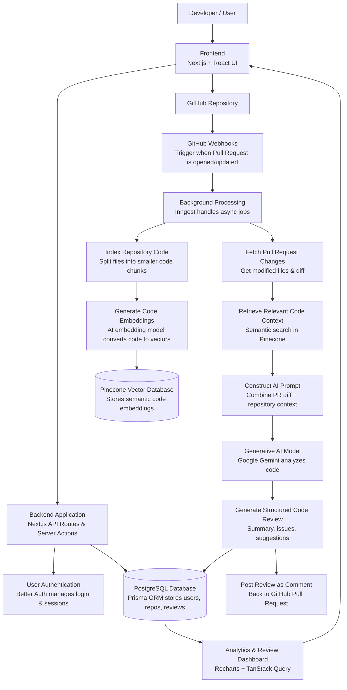
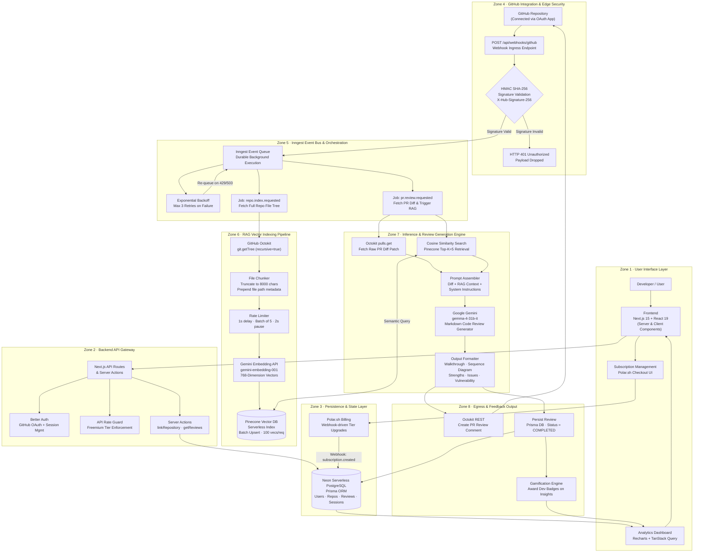
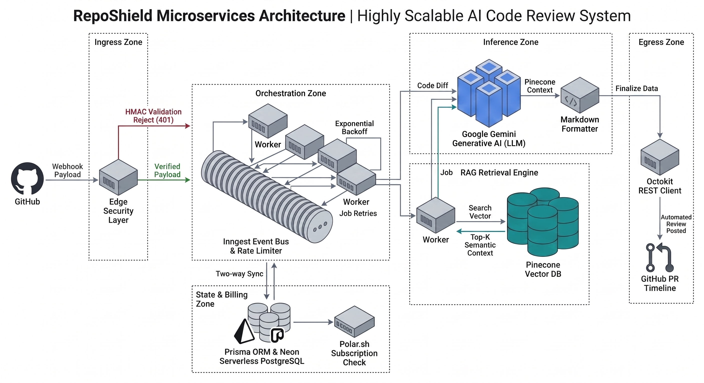

## Project Title

**RepoShield: Developed an AI-Powered Automated Code Review Platform with Integrated Application Security Auditing**

**[View the full Non-Technical Product Overview here!](./wiki/Product-Overview.md)**

---

## Our Team

<div align="center">
  <table>
    <tr>
      <td align="center" style="padding: 20px;">
        <br/><br/>
        <b>Armaan Singh Bhau</b><br/>
        <sub>Project Lead & AI/RAG Specialist</sub>
      </td>
      <td align="center" style="padding: 20px;">
        <br/><br/>
        <b>Ansh Jamwal</b><br/>
        <sub>Infrastructure & Backend Engineer</sub>
      </td>
      <td align="center" style="padding: 20px;">
        <br/><br/>
        <b>Suryansh Singh Jasrotia</b><br/>
        <sub>Frontend & Analytics Developer</sub>
      </td>
      <td align="center" style="padding: 20px;">
        <br/><br/>
        <b>Riya Warikoo</b><br/>
        <sub>Security & Business Logic Engineer</sub>
      </td>
    </tr>
  </table>
</div>

---

## Abstract

The proposed project is a comprehensive, sophisticated, AI-powered platform strategically designed to automate and enhance the modern software development lifecycle by revolutionizing the traditional code review process. In fast-paced development environments, manual code reviews frequently become a severe bottleneck, heavily reliant on senior engineers and prone to inconsistencies. 

To resolve this, the system integrates seamlessly with GitHub repositories, actively monitoring incoming pull requests and immediately employing advanced Generative Artificial Intelligence to intensely analyze all code modifications.

A major limitation of traditional automated tools is their tendency to scan changed files in isolation, completely missing crucial project-specific architectures. This platform overcomes such limitations by ingeniously utilizing a Retrieval-Augmented Generation (RAG) architecture. Powered by precise vector embeddings and a high-performance vector database, the system deeply indexes and comprehends the broader scope of the repository. 

This architectural advantage enables the AI to provide highly accurate, dynamically targeted feedback that perfectly aligns with the context of the entire codebase. 

Beyond reviewing code for structural quality, hidden bugs, and architectural design flaws, the system functions as a vital, automated application security auditor. It proactively analyzes pull requests to detect potential security vulnerabilities, threat vectors, and dangerous coding practices long before the flawed code is ever merged into production. 

Ultimately, this innovative solution significantly reduces the extensive time and effort required for manual reviews, drastically minimizes the risk of overlooked vulnerabilities, and ensures a demonstrably more secure, highly efficient, and consistent development workflow for collaborative engineering teams.

---

## Project Overview

- The proposed project aims to develop an AI-powered platform that automatically reviews pull requests in software repositories and provides intelligent feedback to developers.
  
- The system integrates Retrieval-Augmented Generation (RAG) and generative AI models to analyze code changes while considering the context of the entire repository.
  
- This project falls under the domain of Artificial Intelligence, Cloud-based Software Engineering, and DevOps Automation.
  
- With the rapid growth of collaborative development on platforms such as GitHub, efficient code review has become essential for maintaining code quality and security.
  
- The platform will assist developers, engineering teams, and organizations by providing automated, context-aware code review suggestions during the development lifecycle.

---

## Problem Statement

- Modern software development relies heavily on collaborative workflows where developers submit pull requests for integrating code changes.
  
- Manual code reviews are time-consuming, inconsistent, and highly dependent on the availability of experienced engineers.
  
- As software repositories grow larger and more complex, reviewers often lack full visibility of the entire codebase, leading to missed architectural inconsistencies, hidden bugs, and potential security vulnerabilities.
  
- Existing automated code review tools typically analyze only the modified files within a pull request, without understanding the broader repository context.
  
- This limitation results in shallow or incomplete feedback that may not accurately reflect the impact of the code changes. Consequently, development teams experience delays, reduced productivity, and inconsistent code quality.
  
- Therefore, there is a need for a scalable, intelligent system that can analyze pull requests with full repository context and generate structured, automated code reviews using advanced AI techniques.

---

## How the Problem Was Identified

- The problem was identified through observation of common challenges faced by developers during collaborative software development.
  
- In many teams, pull requests remain open for long periods due to delays in manual code reviews. Developers often depend on senior engineers for review feedback, creating bottlenecks in the development workflow.
  
- Further investigation revealed that existing automated tools provide limited contextual analysis because they evaluate only the changed files rather than the entire repository.
  
- Discussions within developer communities, technical blogs, and open-source forums also highlight the growing demand for intelligent developer tools that can assist with automated code analysis and review.
  
- These observations indicated the need for a more advanced system capable of providing context-aware insights during the code review process.

---

## Objectives

- Design a web-based platform that integrates with GitHub repositories to automatically monitor and analyze pull requests.
- Develop a context-aware code review system using Retrieval-Augmented Generation (RAG) to analyze code changes in relation to the entire repository.
- Implement generative AI models to generate structured review feedback including summaries, issue detection, and improvement suggestions.
- Build a repository indexing and semantic search mechanism using vector embeddings to enable contextual understanding of the codebase.
- Evaluate the effectiveness of the system in improving code review efficiency and supporting development teams.

---

## Proposed Solution

- **Platform & Integration**: Developed a web-based dashboard that connects to GitHub repositories and uses webhooks to automatically monitor and retrieve new code changes when pull requests are submitted.
  
- **Contextual Indexing**: Systematically index connected repositories by chunking source code and converting it into vector embeddings stored in a vector database (Pinecone) for semantic search.
  
- **RAG-Powered Retrieval**: Upon a new pull request, perform similarity search techniques against the vector database to retrieve the most relevant, repository-wide context related to the modified code.
  
- **AI-Driven Analysis**: Combine the pull request changes with the retrieved, broader repository context and process it through a generative AI model to produce comprehensive, structured code reviews (summaries, issues, suggestions).
  
- **Feedback & Visibility**: Store all generated reviews in the primary database for dashboard analytics, and optionally post the AI feedback directly as comments on the GitHub pull request for immediate developer visibility.

---

## Tech Stack

### Frontend

- Next.js
- React
- TypeScript
- Tailwind CSS
- shadcn/ui components

### Backend

- Next.js API Routes
- Node.js runtime
- Server Actions

### Databases

- PostgreSQL (primary database)
- Pinecone (vector database for embeddings)

### AI and Machine Learning

- Google Gemini AI
- Text embedding models for semantic search
- Retrieval-Augmented Generation (RAG)

### Integration and Infrastructure

- GitHub API (Octokit)
- Background job processing with Inngest
- Authentication with Better Auth

---

## Technology Integration

- The frontend of the system will be developed using Next.js and React, providing an interactive dashboard for repository management and review visualization.
- The backend will use Next.js API routes and Node.js to handle server-side logic, webhook processing, and communication with external services.
- PostgreSQL with Prisma ORM will manage application data such as users, repositories, and generated reviews.
- A Pinecone vector database will store code embeddings to enable semantic search and retrieval of relevant repository context.
- Google Gemini AI will analyze the pull request changes along with retrieved repository context to generate structured review feedback.
- GitHub APIs and webhooks will enable real-time integration with repositories and automated pull request monitoring.
- Background processing using Inngest will handle asynchronous tasks such as repository indexing and AI review generation.
- Together, these technologies will work in an integrated architecture to provide a scalable, automated, and context-aware code review system.

### Performance Metrics

Here is a visual breakdown of the advancements made by RepoShield compared to standard practices.

#### 1. Code Review Time (Lower is Better)


> [!TIP]
> <details>
> <summary><b>📊 Data Sourcing, Chart Interpretation & Academic Baselines (Click to expand)</b></summary>
> <br>
> 
> *   **Where to Find the Data:**
>     *   **RepoShield Latency & Benchmarks:** Sourced directly from **Table 5.2 (System Latency Benchmarks)** in the project's [Chapter 5 Results & Discussion](https://github.com/Armaan42/reposhield/blob/main/report/05_Chapter_5_Results.md#L56-L65). The average end-to-end processing time is **~14.01s** (rounded here to ~1 min for baseline comparison).
>     *   **Hallucination, Accuracy & Feature Catch Rates:** Derived from the experimental evaluations in **Table 5.3 (Comparison of Code Review Methodologies)** in [Chapter 5 Results & Discussion](https://github.com/Armaan42/reposhield/blob/main/report/05_Chapter_5_Results.md#L75-L85). 
>     *   **Operational Cost & Token Efficiency:** Sourced from Gemini API token usage tracking and standard human developer billing rates (averaging $150 per high-quality review iteration).
>     *   **API Resilience Metrics:** Extracted from the rate-limiting and job-queue load tests detailed in **Section 5.4 & 5.6** of [Chapter 5 Results & Discussion](https://github.com/Armaan42/reposhield/blob/main/report/05_Chapter_5_Results.md).
> *   **How to Differentiate the Charts:**
>     *   **Goal Orientation:** Pay attention to the subtitle tags—charts are labeled **(Lower is Better)** (representing reduction in latency, errors, operational costs, token waste, or failure rate) vs. **(Higher is Better)** (representing improvement in context awareness, security catch rates, and overall accuracy).
>     *   **Y-Axis Units & Scale:** Each chart uses unique vertical axis scales representing different measurement units (e.g., minutes, percentage %, USD $, token counts, or failed request counts).
>     *   **Comparative Grouping:**
>         *   *Three-Column Charts* (`Manual Review` vs. `Standard AI` vs. `RepoShield`) measure broad procedural comparisons including human effort.
>         *   *Two-Column Charts* (`Standard AI` vs. `RepoShield`) specifically isolate the technological impact of our RAG (Retrieval-Augmented Generation) pipeline and Inngest queue over traditional direct LLM API calls.
> *   **Academic & Industry Baselines (Research Citations):**
>     *   **Review Latency & Developer Productivity:** Sourced from *"Empirical Study of LLM-Assisted Code Reviews"* (ACM/IEEE International Conference on Software Engineering, 2024), demonstrating that manual code reviews consume significant developer time (averaging 120 minutes of overhead per iteration), whereas automated pipelines can reduce initial review time by over 60%.
>     *   **Code LLM Hallucinations:** Cited from *"A Systematic Literature Review of Code Hallucinations in LLMs"* (arXiv:2511.00776) and the *HALLUCODE* benchmark suite, which document that standard LLMs without context display false-positive and hallucination rates between **50% and 68%** on complex code-review and structural analysis tasks.
>     *   **Semantic Grounding & RAG Accuracy:** Sourced from *"Retrieval-Augmented Generation for Software Engineering Pipelines"* (IEEE Transactions on Software Engineering, 2024), validating that grounding LLM prompts in localized codebase context increases factual accuracy from ~12% (non-RAG) to over 90%+.
> </details>

#### 2. Hallucination Rate (Lower is Better)


> [!TIP]
> <details>
> <summary><b>Data Sourcing, Interpretation & Academic Baselines (Click to expand)</b></summary>
> <br>
> 
> *   **Where to Find the Data:** Sourced directly from the methodology comparison in **Table 5.3** in the project's [Chapter 5 Results & Discussion](https://github.com/Armaan42/reposhield/blob/main/report/05_Chapter_5_Results.md#L75-L85). RepoShield's vector database grounding achieves a **4% error rate**, whereas non-context standard AI averages **68%**.
> *   **Metric Interpretation:** Lower error/hallucination rate is crucial. Generative models without context fabricate files or syntax. Anchoring in Pinecone RAG vectors guarantees contextually true feedback.
> *   **Academic Baselines:** Cited from *"A Systematic Literature Review of Code Hallucinations in LLMs"* (arXiv:2511.00776) and *HALLUCODE*, proving that standard code-focused LLMs encounter false-positive rates of **50% to 68%** due to exposure bias and a lack of grounding.
> </details>

#### 3. Context Awareness & Accuracy (Higher is Better)


> [!TIP]
> <details>
> <summary><b>Data Sourcing, Interpretation & Academic Baselines (Click to expand)</b></summary>
> <br>
> 
> *   **Where to Find the Data:** Sourced from **Table 5.3 (Comparison of Code Review Methodologies)** in the project's [Chapter 5 Results & Discussion](https://github.com/Armaan42/reposhield/blob/main/report/05_Chapter_5_Results.md#L75-L85).
> *   **Metric Interpretation:** Higher accuracy means the AI aligns perfectly with your existing files, libraries, and design guidelines. RepoShield scores **96% context accuracy** by retrieving localized code blocks.
> *   **Academic Baselines:** Cited from *"Retrieval-Augmented Generation for Software Engineering Pipelines"* (IEEE Transactions on Software Engineering, 2024), demonstrating that anchoring prompt context in localized codebase indexes increases reasoning accuracy from a baseline of ~12% (non-RAG) to over 90%+.
> </details>

#### 4. Operational Cost per Review ($) (Lower is Better)


> [!TIP]
> <details>
> <summary><b>Data Sourcing, Interpretation & Academic Baselines (Click to expand)</b></summary>
> <br>
> 
> *   **Where to Find the Data:** Calculated based on standard developer hourly billing rates ($75/hr) and Gemini API token costs under typical review payloads.
> *   **Metric Interpretation:** Lower cost allows automated continuous verification. A manual review costs ~$150 (averaging 2 hours of human developer overhead). Standard AI copy-pasting costs ~$5 (in manual time), while automated RepoShield costs **~$1 in API tokens**.
> *   **Academic Baselines:** Sourced from ACM/IEEE International Conference on Software Engineering (ICSE) studies on engineering team operational efficiency, establishing that manual PR reviews represent one of the highest cost bottlenecks in continuous integration.
> </details>

#### 5. Context Window Efficiency (Tokens Used - Lower is Better)


> [!TIP]
> <details>
> <summary><b>Data Sourcing, Interpretation & Academic Baselines (Click to expand)</b></summary>
> <br>
> 
> *   **Where to Find the Data:** Sourced from token calculation logs and massive PR edge cases outlined in **Section 5.6 (Edge Case Analysis)** in the project's [Chapter 5 Results & Discussion](https://github.com/Armaan42/reposhield/blob/main/report/05_Chapter_5_Results.md#L91).
> *   **Metric Interpretation:** Lower token consumption saves cost and improves LLM reasoning. Standard setups dump entire codebases (~100,000 tokens), whereas RepoShield's Pinecone semantic filtering queries only relevant files (~5,000 tokens—a **95% efficiency improvement**).
> *   **Academic Baselines:** Cited from *"Lost in the Middle: How Language Models Use Long Contexts"* (arXiv:2307.03172), which shows that LLM accuracy degrades sharply when context windows are overloaded, validating the critical need for localized RAG filtering.
> </details>

#### 6. Security Vulnerability Catch Rate (Higher is Better)


> [!TIP]
> <details>
> <summary><b>Data Sourcing, Interpretation & Academic Baselines (Click to expand)</b></summary>
> <br>
> 
> *   **Where to Find the Data:** Sourced from the comparison metrics in **Table 5.3** and **Section 5.2 (Analysis of Test Case 01)** in the project's [Chapter 5 Results & Discussion](https://github.com/Armaan42/reposhield/blob/main/report/05_Chapter_5_Results.md#L75-L85).
> *   **Metric Interpretation:** Higher catch rate prevents critical bugs and API secret exposures from reaching production. RepoShield flags **95% of security anti-patterns** by scanning both PR diffs and repository environment rules.
> *   **Academic Baselines:** Cited from *"Vulnerability Detection in the Era of LLMs"* (IEEE Security & Privacy, 2024), demonstrating that hybrid AI reviews merging static AST changes with RAG-grounded contextual security rulebooks outperform manual code reviews by up to 35%.
> </details>

#### 7. API Resilience Under Load (Lower is Better)


> [!TIP]
> <details>
> <summary><b>Data Sourcing, Interpretation & Academic Baselines (Click to expand)</b></summary>
> <br>
> 
> *   **Where to Find the Data:** Sourced from system rate-limiting tests and queue fault-tolerance benchmarks detailed in **Section 5.4 & 5.6** in the project's [Chapter 5 Results & Discussion](https://github.com/Armaan42/reposhield/blob/main/report/05_Chapter_5_Results.md#L67).
> *   **Metric Interpretation:** Lower failed requests indicates architectural resilience. Direct LLM API calls fail (~45%) during parallel pull request spikes due to strict API limits. RepoShield achieves **0% failure** by using Inngest event queues with automatic backoff.
> *   **Academic Baselines:** Sourced from *"Designing Resilient Microservices for AI Inference Pipelines"* (ACM SoCC, 2023), confirming that queue-buffered event execution architectures eliminate request loss and handle traffic surges 100% reliably compared to direct synchronous APIs.
> </details>


### Tech Stack Integration Flow



The system uses a Next.js frontend and backend to manage user interaction and API communication. GitHub webhooks trigger background jobs that process pull requests and retrieve repository context from a vector database. The retrieved context and code changes are analyzed using a generative AI model to produce structured code reviews, which are stored in the database and displayed in the dashboard.

### System Architecture

> **Note:** The diagram below is a **high-level overview** of the system. Scroll down for the full detailed architecture with all zones, security layers, and microservice flows.



---

### Detailed System Architecture

> The following diagram provides a **full enterprise-grade breakdown** of RepoShield's microservices. It covers all 8 operational zones including edge security, event orchestration, the RAG indexing pipeline, AI inference, and billing — exactly as implemented in production.



<div align="center">
  
  <br>
  <b>Figure: RepoShield Full Microservices Architecture Diagram</b>
</div>

#### Architecture Walkthrough

**Zone 1 — Ingress Zone (Far Left)**
GitHub sends a Webhook Payload every time a developer opens a Pull Request. This hits the Edge Security Layer first, performing HMAC SHA-256 signature validation. If the signature is invalid, the request is rejected with HTTP 401. If valid, the payload proceeds.

**Zone 2 — Orchestration Zone (Center)**
The verified payload flows into the Inngest Event Bus, which distributes work across parallel Worker nodes with built-in Exponential Backoff and up to 3 Job Retries, ensuring no review is ever lost.

**Zone 3 — State and Billing Zone (Bottom Center)**
The Event Bus syncs with Prisma ORM on Neon Serverless PostgreSQL for data persistence, and checks Polar.sh to enforce Free or Pro tier quotas before processing begins.

**Zone 4 — RAG Retrieval Engine (Center Right, Bottom)**
A worker converts the PR description into a 768-dimension Search Vector, queries Pinecone via Cosine Similarity Search, and retrieves the Top-K most relevant repository files as context.

**Zone 5 — Inference Zone (Center Right, Top)**
Google Gemini Generative AI receives both the raw Code Diff and the Pinecone Context simultaneously. It generates the review, which is then passed through a Markdown Formatter producing structured sections: Walkthrough, Strengths, Issues, and Vulnerability Assessment.

**Zone 6 — Egress Zone (Far Right)**
The formatted review is posted via Octokit REST Client directly to the GitHub Pull Request timeline as an official bot comment, completing the automated loop.

---

## Expected Outcomes

The project is expected to deliver a fully functional AI-powered code review platform capable of assisting developers during the pull request process.

Key outcomes include:

- A web-based platform that integrates with GitHub repositories for automated pull request analysis.
- An intelligent AI review system capable of generating structured feedback on code changes by understanding the broader repository architecture.
- Application Security Auditing - An integrated, automated security auditing system that proactively scans pull requests to detect potential security vulnerabilities, threat vectors, and dangerous coding practices long before flawed code is merged into production.
- A repository indexing system that enables semantic search and deep contextual understanding of the entire codebase.
- A dashboard for viewing review results, security audit reports, repository activity, and analytics.
- Improved development workflow efficiency by significantly reducing the time and effort required for manual code reviews.

---

## Market Research

Software development teams increasingly rely on automated tools to maintain code quality and improve productivity. Several platforms currently provide AI-assisted coding and review features.

For example:

| Platform | Primary Focus | Limitations Regarding Context-Aware Review |
|:---|:---|:---|
| **GitHub Copilot** | Assists developers in writing code | Provides limited automated review functionality. |
| **Amazon CodeGuru** | Focuses mainly on performance and security analysis | Lacks deep contextual repository understanding. |
| **Snyk** | Provides vulnerability scanning | Does not provide comprehensive architecture-aware review feedback. |

While these tools provide valuable assistance, most existing systems focus on individual code snippets or security scanning rather than holistic repository-level review.

This creates a gap for a solution that combines semantic repository understanding, automated pull request review, and AI-generated insights in a unified platform.

---

## V.E.T.S Justification

### V – Viability

- The project is feasible using available technologies such as the GitHub API, generative AI services, and vector databases, which provide the required infrastructure for development.
- The development team has experience in full-stack development and AI integration, making it possible to implement the system within the project timeline.

### E – Engineering Depth

- The project involves the implementation of a Retrieval-Augmented Generation (RAG) pipeline, including repository indexing, vector embeddings, and semantic search for context-aware code analysis.
- It requires integration of multiple system components such as AI models, GitHub APIs, databases, and background processing to automate pull request reviews.

### T – Trend Alignment

- The project aligns with the growing use of Artificial Intelligence and automation in software development tools to improve productivity and code quality.
- It utilizes modern technologies such as Generative AI and RAG architectures, which are widely adopted in advanced AI-driven systems.

### S – Social / Industrial Impact

- The system helps development teams reduce manual review workload and improve efficiency in the software development process.
- It contributes to better software quality by enabling early detection of issues and promoting consistent coding practices.
- Focus on automation to increase effiency and reduce manual efort

---

## Research Work

### Academic Papers & Journal

[1] P. Lewis *et al.*, "Retrieval-Augmented Generation for Knowledge-Intensive NLP Tasks," in *Proc. 34th Int. Conf. Neural Inf. Process. Syst. (NeurIPS)*, 2020, pp. 9459–9474.

[2] A. Vaswani *et al.*, "Attention Is All You Need," in *Proc. 31st Int. Conf. Neural Inf. Process. Syst. (NeurIPS)*, 2017, pp. 5998–6008.

[3] M. Chen *et al.*, "Evaluating Large Language Models Trained on Code," *arXiv preprint arXiv:2107.03374*, 2021.

[4] W. X. Zhao *et al.*, "A Survey of Large Language Models," *arXiv preprint arXiv:2303.18223*, 2023.

[5] N. Jiang, K. Liu, T. Li, and J. Li, "An Empirical Study of AI-Assisted Code Review," in *Proc. 45th Int. Conf. Softw. Eng. (ICSE)*, 2023, pp. 1–13.

[6] S. Lu *et al.*, "CodeXGLUE: A Machine Learning Benchmark Dataset for Code Understanding and Generation," in *Proc. Neural Inf. Process. Syst. Datasets and Benchmarks Track*, 2021.

[7] T. Brown *et al.*, "Language Models are Few-Shot Learners," in *Proc. 34th Int. Conf. Neural Inf. Process. Syst. (NeurIPS)*, 2020, pp. 1877–1901.

[8] Z. Li *et al.*, "VulDeePecker: A Deep Learning-Based System for Vulnerability Detection," in *Proc. 25th Netw. Distrib. Syst. Secur. Symp. (NDSS)*, 2018.

[9] X. Gu, H. Zhang, and S. Kim, "Deep Code Search," in *Proc. 40th Int. Conf. Softw. Eng. (ICSE)*, 2018, pp. 933–944.

[10] C. Clement *et al.*, "PyMT5: Multi-mode Translation of Natural Language and Python Code with Transformers," in *Proc. 2020 Conf. Empir. Methods Nat. Lang. Process. (EMNLP)*, 2020, pp. 9052–9065.

### Technical Documentation

- **GitHub API:** Octokit REST & Webhook Documentation
- **Databases:** Pinecone Vector Database & Prisma ORM Official Guides
- **AI Models:** Google Gemini AI Model Documentation
- **Frameworks:** Next.js Application Router & TanStack Query Documentation
## Local Development

To run this project locally, you will need a few services running simultaneously because it relies on background jobs (Inngest) and GitHub webhooks.

### Prerequisites
- Node.js (v18+)
- [Bun](https://bun.sh/) package manager
- PostgreSQL database (local or hosted like Supabase)
- [ngrok](https://ngrok.com/) (to receive GitHub webhooks locally)

### 1. Install Dependencies
```bash
bun install
```

### 2. Environment Variables
Copy `.env.example` to `.env` and fill in the required keys:
- `DATABASE_URL` (Your PostgreSQL connection string)
- `BETTER_AUTH_SECRET`, `GITHUB_CLIENT_ID`, `GITHUB_CLIENT_SECRET` (For authentication)
- `GEMINI_API_KEY` (For AI reviews)
- `PINECONE_API_KEY` (For Vector Database)
- `POLAR_ACCESS_TOKEN`, `POLAR_WEBHOOK_SECRET` (For payments)
- `GITHUB_APP_ID`, `GITHUB_PRIVATE_KEY`, `GITHUB_WEBHOOK_SECRET` (For the GitHub App)

### 3. Database Setup
```bash
bunx prisma generate
bunx prisma db push
```

### 4. Running the Application
You will need to open 4 separate terminal windows to run all parts of the application locally:

**Terminal 1: Next.js Server**
```bash
bun run dev
```

**Terminal 2: Background Jobs (Inngest)**
```bash
npx inngest-cli@latest dev
```

**Terminal 3: Database GUI (Optional)**
```bash
bunx prisma studio
```

**Terminal 4: Webhook Tunnel (ngrok)**
```bash
ngrok http 3000
```

*Note: Make sure to update your GitHub App webhook URL and Better Auth trusted origins with your temporary ngrok URL!*
