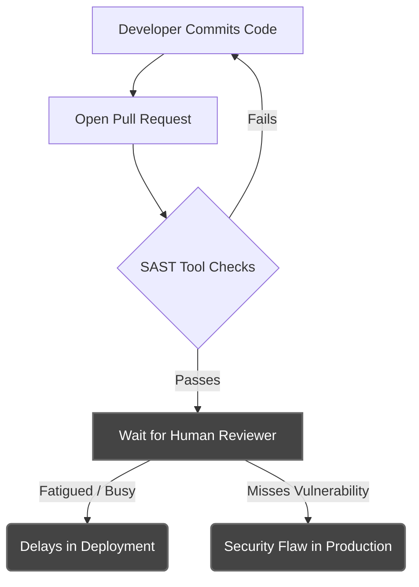

# CHAPTER 2: LITERATURE SURVEY & PROBLEM FORMULATION

## 2.1 Review of Existing Work

The integration of quality assurance and security checks into the software development lifecycle has evolved significantly over the years. A comprehensive review of the current landscape reveals three primary methodologies for code review and security auditing: Manual Code Reviews, Static Application Security Testing (SAST) tools, and localized AI Coding Assistants.

### 2.1.1 Manual Code Reviews
Manual code review is the traditional and most widely adopted method in the industry. It involves peer developers reading through a Pull Request to identify bugs, ensure adherence to style guides, and validate business logic. 
*   **Strengths:** Human reviewers possess a deep understanding of the project's unique business logic, architectural constraints, and historical context. They can make subjective decisions about design patterns that automated tools might miss.
*   **Weaknesses:** Manual reviews are inherently slow, subjective, and prone to human error. As repositories grow and CI/CD pipelines demand faster release cycles, human reviewers often suffer from fatigue, especially when reviewing massive code diffs. Furthermore, detecting complex security vulnerabilities (e.g., subtle race conditions or deep SQL injection vectors) requires specialized cybersecurity knowledge that the average developer may not possess.

### 2.1.2 Static Application Security Testing (SAST)
Tools such as SonarQube, Snyk, and ESLint form the backbone of automated CI/CD pipelines. These tools parse source code into Abstract Syntax Trees (ASTs) and run predefined rulesets against them to flag syntax errors, code smells, and known security anti-patterns.
*   **Strengths:** SAST tools are incredibly fast, deterministic, and can be easily integrated into automated pipelines. They are excellent at enforcing consistent coding standards across large teams.
*   **Weaknesses:** SAST tools lack contextual awareness of the broader business logic. Because they rely strictly on predefined rules, they notoriously generate a high volume of false positives. They cannot understand the *intent* behind the code, nor can they suggest architectural improvements or refactoring strategies that fall outside their programmed rulesets.

### 2.1.3 Basic AI Integration and LLMs
The recent advent of Large Language Models (LLMs) has given rise to tools like GitHub Copilot, Tabnine, and standard ChatGPT web interfaces.
*   **Strengths:** These tools excel at inline code completion, generating boilerplate code, and providing conversational explanations for isolated code snippets.
*   **Weaknesses:** Tools like Copilot are confined to the developer's local IDE and do not act as an automated gatekeeper on Pull Requests. Conversely, pasting code into a chat interface like ChatGPT strips the code of its repository-wide context. The AI does not know about the database schema in `schema.prisma`, the utility functions in `/lib`, or the global state management unless the user manually pastes every related file into the prompt—a tedious and unscalable process.

**Table 2.1: Summary of Existing Code Review Methodologies**

| Methodology | Primary Advantage | Major Drawback | Contextual Awareness? |
|-------------|-------------------|----------------|-----------------------|
| **Manual Review** | High accuracy for custom business logic | Slow, prone to human fatigue | Yes (Depends on Human) |
| **SAST (SonarQube)** | Fast, automated, deterministic | High false-positive rate, rigid | No (File-by-file) |
| **Basic AI (Copilot)**| Excellent for inline autocomplete | IDE-locked, no automated PR checks| Partial (Current File) |

## 2.2 Research Gaps

Despite the prevalence of the methodologies discussed above, a critical research gap exists at the intersection of automated CI/CD pipelines and contextual AI understanding.

1.  **Lack of Cross-File Contextual Awareness:** When a PR is submitted, standard automated tools only analyze the *diff* (the lines changed). They fail to retrieve or understand how a change in `utils.ts` might inadvertently break a database query in `actions.ts`. 
2.  **Serverless Execution Limits:** Modern web applications frequently use serverless functions (e.g., AWS Lambda, Vercel). These platforms impose strict execution timeouts (often 10 seconds). Passing a large repository context to an LLM and waiting for a comprehensive review generation routinely exceeds these timeouts, causing the webhook to fail and drop the PR event entirely.
3.  **High Cost and Latency of Large Context Windows:** While some modern LLMs boast massive context windows (e.g., 1 million tokens), blindly feeding an entire repository into the prompt for every PR review is prohibitively expensive and introduces severe latency, making it unsuitable for rapid CI/CD cycles.

**Figure 2.1: The Bottleneck in Current CI/CD Workflows**

## 2.3 Problem Statement

Based on the identified research gaps, the formal problem statement for this project is defined as follows:

*“To design and implement an autonomous, event-driven code review platform that intercepts GitHub Pull Requests, intelligently retrieves only the relevant cross-file context from the broader repository using a vector database, and leverages Large Language Models to generate accurate, context-aware architectural and security audits, all without interrupting the developer's standard CI/CD workflow or exceeding serverless execution limits.”*

## 2.4 Detailed Objectives

To solve the stated problem, the proposed system (RepoShield) aims to achieve the following specific objectives:
1.  **Secure Webhook Ingestion:** Implement cryptographic validation to securely receive and parse GitHub PR events.
2.  **Vector-Based Knowledge Base:** Develop a pipeline to chunk and embed repository files into a Pinecone vector database, enabling rapid semantic similarity searches.
3.  **Retrieval-Augmented Generation (RAG):** Combine the PR diff with the semantically relevant files retrieved from the vector database to provide the LLM with a highly targeted contextual prompt, minimizing token usage and maximizing accuracy.
4.  **Asynchronous Orchestration:** Utilize a background job queue to decouple the webhook reception from the LLM generation, solving the serverless timeout constraint.
5.  **Actionable Feedback:** Output the AI's analysis directly to the GitHub PR timeline in a highly readable, structured markdown format containing sequence diagrams and vulnerability assessments.

## 2.5 Methodology Overview

To achieve these objectives, RepoShield adopts a modern, decoupled architecture. 

The methodology hinges on the **Retrieval-Augmented Generation (RAG)** paradigm. Instead of relying on the LLM's pre-trained knowledge or attempting to feed it the entire repository, the system creates a specialized, searchable index of the specific codebase. This is achieved by generating high-dimensional vectors for every file using the Google Gemini Embedding API. 

When a PR is triggered, the system asynchronously queues a job using **Inngest**. The job extracts the PR title and description, converts them into a search vector, and queries the **Pinecone** database. Pinecone returns the top most relevant codebase files (the "Context"). The system then constructs a strict prompt containing the Context, the PR Diff, and detailed instructions for the review structure. This prompt is processed by the **Google Gemini `gemma-4-31b-it`** model, which generates the final review. Finally, the system leverages the **Octokit** REST API to post this review as a bot comment on the GitHub PR, completing the automated lifecycle.

## 2.6 Theoretical Underpinnings of the Architecture

To fully appreciate the architecture of RepoShield, it is necessary to explore the academic and theoretical concepts that drive its core modules.

### 2.6.1 Retrieval-Augmented Generation (RAG)
Large Language Models, while incredibly powerful, suffer from a phenomenon known as "hallucination"—the generation of syntactically correct but factually inaccurate information. In the context of software engineering, an LLM might suggest importing a utility function that does not exist or referencing a database table that was never defined.

The Retrieval-Augmented Generation (RAG) framework, originally introduced by researchers at Meta AI (formerly Facebook AI Research), solves this by grounding the generation process in an external knowledge base. RAG operates in two phases:
1. **Retrieval Phase:** Given an input query, a neural retriever scans a corpus of documents and returns the top-K most relevant texts.
2. **Generation Phase:** A sequence-to-sequence model receives both the original query and the retrieved documents, synthesizing an answer derived strictly from the provided factual context.

RepoShield applies the RAG paradigm directly to source code, ensuring that all AI critiques and suggestions are anchored in the actual architectural reality of the user's repository.

### 2.6.2 High-Dimensional Vector Embeddings & Cosine Similarity
The retrieval mechanism in a RAG pipeline relies on Vector Embeddings. Traditional database searches use keyword matching (lexical search), which fails to capture semantic meaning (e.g., recognizing that a "user authentication" module is semantically related to a "login component"). 

Embedding models (such as `gemini-embedding-001`) utilize transformer architectures to map strings of text into a high-dimensional continuous vector space (typically 768 dimensions). Texts with similar semantic meaning are mapped to points that are physically closer together in this vector space.

To determine relevance, Pinecone calculates the **Cosine Similarity** between the user's PR description (the query vector) and the repository files (the document vectors). The cosine similarity measures the cosine of the angle between two multi-dimensional vectors, outputting a value between -1 and 1. A score approaching 1 indicates high semantic correlation, dictating which files are injected into the prompt context.

### 2.6.3 The Shift to Event-Driven Serverless Architectures
Historically, backend applications were deployed as monolithic servers that remained constantly active, consuming resources regardless of traffic. The modern cloud era introduced Serverless architectures (e.g., AWS Lambda, Vercel Serverless Functions), where compute instances spin up on-demand to handle individual HTTP requests and spin down immediately after.

While serverless environments are highly cost-effective and scale infinitely, they introduce the "timeout constraint"—a hard limit (often 10 to 60 seconds) on how long a function can run before the cloud provider kills the process. 

Because executing a RAG pipeline and querying an LLM inherently involves unpredictable network latency and token generation times that frequently exceed these limits, a synchronous architecture is impossible. RepoShield overcomes this through an **Event-Driven Architecture (EDA)**. By utilizing Inngest, the serverless function simply receives the webhook, dispatches an event payload to a highly available messaging queue, and immediately returns a `200 OK` response to GitHub within milliseconds. The heavy processing is then executed asynchronously by distributed background workers, effectively bypassing the serverless timeout constraints.
