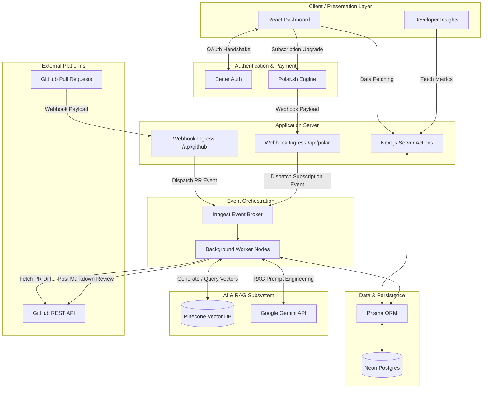
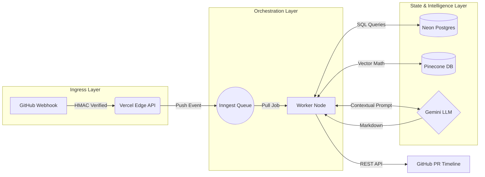
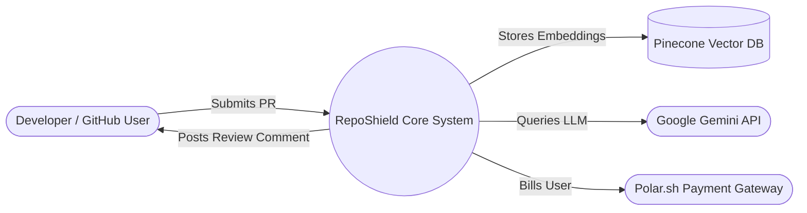
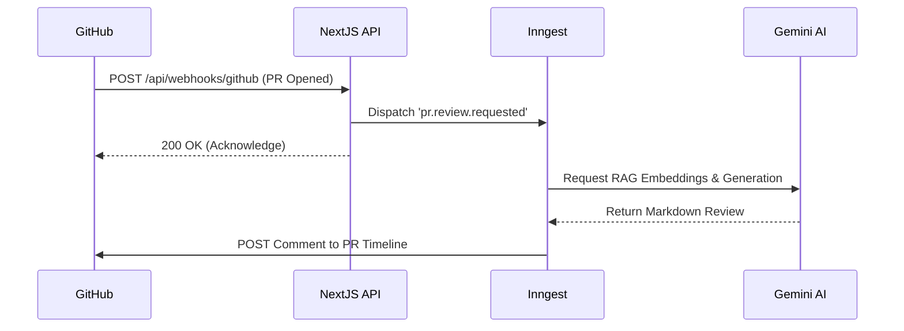
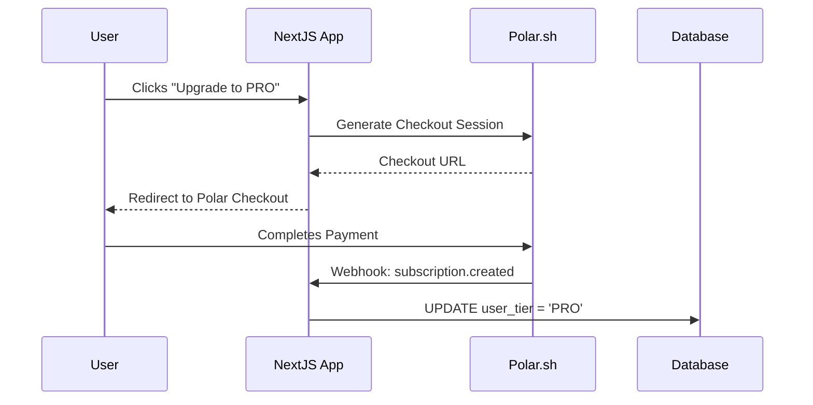

# CHAPTER 3: SYSTEM DESIGN / METHODOLOGY

This chapter provides a detailed exposition of the architectural design decisions and engineering methodologies employed in building the RepoShield platform. It covers the overall system architecture, the Feature-Module pattern used for code organization, the relational database schema, the data flow across all operational zones, and the complete technology stack selection rationale. Each design choice is justified with respect to scalability, maintainability, and production readiness.

## 3.1 Overall System Architecture

RepoShield is engineered using a highly scalable, modern web architecture optimized for AI integration and asynchronous background processing. The application is built upon the **Next.js 15 App Router** framework, running on a Node.js environment. 

To maintain clean code separation and enforce domain-driven design, the project strictly adheres to a **Feature-Module Pattern**. This approach decouples the user interface layer from the core business logic, ensuring that the system is maintainable and scalable as new features are introduced.

*   **`/app` Directory (Presentation Layer):** This directory is exclusively responsible for routing, React Server Components (RSCs), and API route handlers. It handles the UI layout, dashboards, and client-side interactions.
*   **`/module` Directory (Domain Layer):** This directory encapsulates all core business logic, organized by feature domains such as `ai` (RAG pipeline), `github` (API and webhooks), `payment` (Polar.sh subscriptions), `repository` (onboarding logic), and `review` (database operations).

The overarching architecture operates across three distinct functional layers:
1.  **The Client Layer:** A responsive, dark-themed dashboard constructed with Tailwind CSS v4 and Shadcn UI. It allows users to authenticate via GitHub, onboard repositories, manage their subscription tiers, and view visual insights plotted via Recharts.
2.  **The Server & Orchestration Layer:** Standard synchronous tasks are handled via Next.js Server Actions. However, intensive tasks like AI generation and repository indexing are offloaded to **Inngest**, a robust event-driven background job orchestrator. This decoupling is critical to bypassing the strict 10-second timeout limit imposed by serverless hosting environments.
3.  **The Data & AI Layer:** Relational data (users, reviews, subscription status) is managed via Prisma ORM connected to a Neon PostgreSQL serverless database. Semantic, unstructured data (codebase embeddings) is managed via the Pinecone Vector Database. The Google Gemini API serves as the intelligence engine, handling both the creation of vector embeddings and the generation of the final text reviews.

**Figure 3.1: High-level System Architecture Diagram**

### 3.1.1 Deep Dive into the Microservice Architecture

While the codebase is technically housed in a single monorepo, it behaves in production as a distributed microservice architecture. This guarantees that heavy AI workloads do not block the main UI thread or the webhook ingestion endpoints. The architecture is logically split into four highly specialized nodes:

1. **The Ingress Node (API Gateway):** This node lives on the Vercel Edge network. Its sole responsibility is to ingest incoming HTTP POST requests from GitHub and Polar.sh. It performs constant-time cryptographic hash verifications to authenticate the payloads. Because this node does no heavy lifting, it can return a `200 OK` response to GitHub within 15 milliseconds, effectively preventing GitHub from throwing a timeout error.
2. **The Worker Node (Inngest Orchestrator):** Once the Ingress Node verifies a payload, it pushes an event (e.g., `pr.review.requested`) to the Inngest message broker. The Worker Node pulls these jobs from the queue. It is responsible for orchestrating the multi-step RAG pipeline. If the Gemini API throws a rate-limit error, the Worker Node pauses the execution state and retries 60 seconds later without dropping the payload.
3. **The State Management Node (Prisma + Neon):** This node maintains the application's source of truth. It manages relational constraints, such as ensuring a user on the FREE tier cannot onboard a 6th repository. It uses a serverless connection pooler (pgBouncer) to ensure that bursts of concurrent webhook traffic do not exhaust the database's maximum TCP connection limit.
4. **The Inference Node (Gemini + Pinecone):** The pure "intelligence" layer. The Worker node streams raw code text into the Pinecone database to be converted into continuous vectors. During a PR review, it performs the Cosine Similarity math. Finally, the Google Gemini instance acts as the final inference engine, reading the compiled prompt and streaming the generated markdown back to the Worker Node.

**Figure 3.2: Component-Level Microservice Flow**

## 3.2 Module Design

The system is decomposed into a set of specialized, cohesive modules that collaborate to execute the automated code review workflow. This section outlines the functional design, responsibilities, and integration strategies for the key components of the platform, including secure webhook ingestion, resilient event-driven execution pipelines, vector-based semantic search networks, and subscription-based tier enforcement. Each module is engineered to prioritize security, low latency, and high horizontal scalability under parallel execution spikes.

### 3.2.1 GitHub Webhook & App Integration Module
RepoShield operates as a certified, installable GitHub App rather than a simple OAuth script. Upon installation, the platform requests granular, least-privilege permissions: `Pull Requests: Read & Write` and `Repository Contents: Read`. 

When a developer opens or updates a Pull Request, GitHub fires a webhook payload to the `/api/webhooks/github` endpoint. Security is paramount at this ingress point. The module computes a SHA256 Hash-based Message Authentication Code (HMAC) using the incoming payload and the secret `GITHUB_CLIENT_SECRET`. Only if this locally computed hash strictly matches the `X-Hub-Signature-256` header provided by GitHub is the payload accepted. Once validated, the module extracts the repository owner, name, and PR number, and fires an event to the Inngest event bus.

**Figure 3.3: DFD Level 0 (Context Diagram) of RepoShield**

### 3.2.2 Event-Driven Background Processing (Inngest)
Handling AI operations synchronously within a standard HTTP request cycle is an anti-pattern due to unpredictable LLM response times. RepoShield utilizes **Inngest** to establish a resilient, event-driven queue. 

When events like `repository.connected` or `pr.review.requested` are fired, Inngest intercepts them and executes the corresponding functions (`indexRepo` and `generateReview`) in the background. Inngest provides out-of-the-box features crucial for this project, including step-level state recovery, exponential backoffs for API rate limits, and concurrency management (e.g., limiting the system to process a maximum of 5 concurrent reviews to prevent Gemini API quota exhaustion).

**Figure 3.4: Event-Driven Inngest Background Pipeline**

### 3.2.3 RAG Pipeline (Pinecone & Gemini Embeddings)
The core innovation of RepoShield is its Retrieval-Augmented Generation (RAG) pipeline, which grants the LLM context of the entire repository. This module consists of two distinct phases:

*   **Phase 1: Indexing.** When a new repository is linked to RepoShield, the system fetches the entire file tree using the Octokit REST API. Each file is read, and its content is truncated to a maximum of 8,000 characters to fit embedding limits. The Google Gemini `gemini-embedding-001` model converts this text into a 768-dimensional float array (a vector). These vectors, alongside metadata like the file path and raw content, are upserted into a Pinecone index.
*   **Phase 2: Retrieval.** When a Pull Request is submitted, the PR title and description are extracted and converted into a search vector using the same Gemini embedding model. The system queries the Pinecone database to find the top-K vectors with the highest Cosine Similarity to the search vector. The raw text content of these top-K most relevant files is retrieved and injected directly into the LLM prompt, providing the AI with the exact architectural context it needs to evaluate the PR accurately.

### 3.2.4 Payment & Subscription Tiering
To ensure the platform is financially viable, RepoShield integrates with **Polar.sh** for monetization. The payment module handles checkout procedures and listens to Polar webhooks to update user subscription statuses in the PostgreSQL database. Enforcement logic (`canConnectRepository` and `canCreateReview`) restricts FREE tier users to a maximum of 5 repositories and 5 automated reviews per repository. Upgrading to the PRO tier via the dashboard lifts these restrictions.

**Figure 3.5: Polar.sh Subscription Flow**

## 3.3 Database Schema Design

The relational database is hosted on Neon PostgreSQL and managed declaratively via Prisma ORM. The schema is designed for rapid relational queries and strict referential integrity.

**Table 3.1: Core Database Models and Relationships**

| Model Name | Primary Key | Foreign Key Relations | Primary Purpose & Description | Key Attributes / Enums |
| :--- | :--- | :--- | :--- | :--- |
| **User** | `id` (UUID) | `repositories[]`, `accounts[]`, `sessions[]` | Stores root identity profile information and manages the user's current monetization tier. | `email`, `name`, `image`, `tier` (FREE/PRO), `stripeCustomerId` |
| **Account** | `id` (String) | `userId` -> `User.id` | Securely managed by Better Auth. Handles multi-provider OAuth tokens (GitHub) and credential rotation. | `provider`, `providerAccountId`, `accessToken`, `refreshToken` |
| **Session** | `id` (String) | `userId` -> `User.id` | Tracks active authenticated web sessions for the Next.js dashboard to ensure stateless security. | `sessionToken`, `expires`, `ipAddress`, `userAgent` |
| **Repository** | `id` (UUID) | `userId` -> `User.id`, `reviews[]` | Stores metadata for tracked GitHub repositories. Acts as the parent node for indexing statuses and reviews. | `name`, `owner`, `githubId`, `url`, `isIndexed` (Boolean) |
| **Review** | `id` (UUID) | `repositoryId` -> `Repository.id` | Tracks individual Pull Request reviews generated by the RAG pipeline for historical auditing. | `prNumber`, `markdownContent`, `status` (PENDING/COMPLETED/FAILED) |
| **UsageLog** | `id` (UUID) | `userId` -> `User.id` | Used to enforce API rate limits and track monthly token/execution quotas for Freemium users. | `eventType` (INDEX/REVIEW), `tokenCount`, `createdAt` |

## 3.4 Tools & Technologies

The selection of the technology stack was driven by requirements for high performance, developer ergonomics, and seamless AI integration.

*   **Frontend Framework:** Next.js 15 utilizing React 19 Server Components for optimized rendering and minimal client-side JavaScript bundles.
*   **Styling & UI:** Tailwind CSS v4 provides utility-first styling, while Shadcn UI supplies accessible, unstyled Radix UI primitives. Lucide React provides iconography, and Recharts handles data visualization on the dashboard.
*   **Backend Runtime:** Node.js environment via the Next.js App Router.
*   **Database & ORM:** Prisma ORM for type-safe database access, connected to a Neon Serverless PostgreSQL instance via the `@prisma/adapter-pg` driver.
*   **AI Engine:** The Vercel AI SDK (`ai` package) serves as the unified interface to the Google Generative AI provider (`@ai-sdk/google`). Models utilized include `gemini-embedding-001` for vectorization and `gemma-4-31b-it` for natural language and code critique generation.
*   **Vector Database:** Pinecone (`@pinecone-database/pinecone`), operating as the high-speed semantic search engine for the RAG pipeline.
*   **Orchestration:** Inngest (`inngest`) for durable background job execution.
*   **Authentication & Billing:** Better Auth (`better-auth`) handles complex OAuth flows, while Polar.sh SDKs manage subscriptions and checkout sessions.
