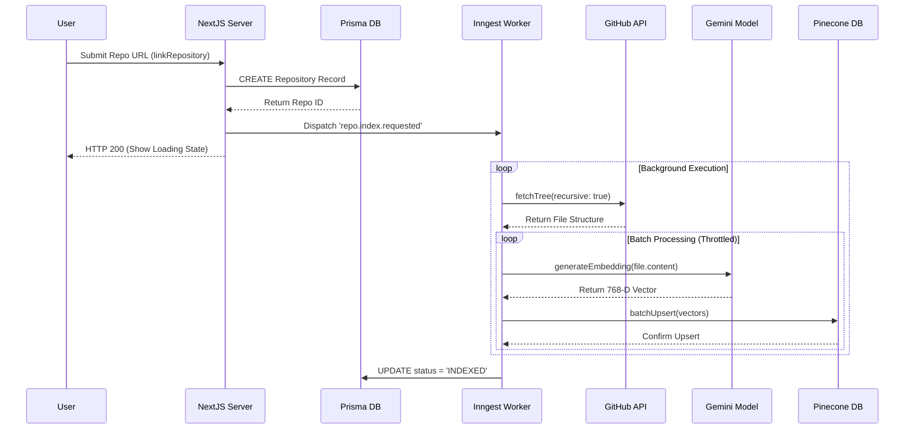
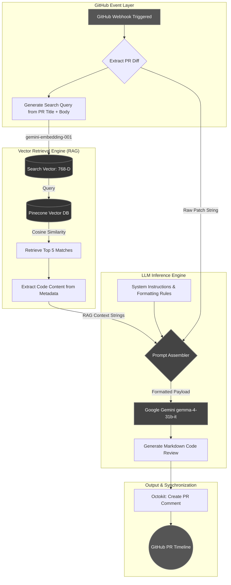
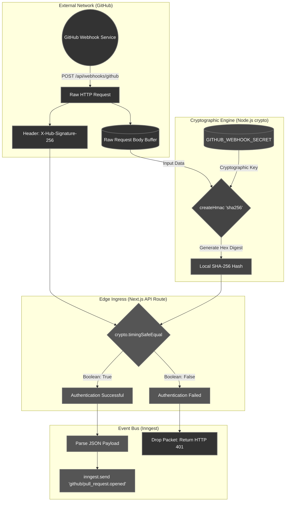

# CHAPTER 4: IMPLEMENTATION

## 4.1 Development Environment Setup

The implementation phase of RepoShield required orchestrating multiple local and cloud-based services simultaneously to replicate the complex event-driven architecture of the production environment. 

The core application was bootstrapped using the Next.js App Router template, strictly typed with TypeScript. Code consistency was enforced using ESLint and Prettier. The relational database was provisioned on the Neon.tech serverless PostgreSQL platform. The local Prisma schema, containing models for Users, Repositories, and Reviews, was synchronized with the remote database utilizing the `npx prisma db push` command.

Because RepoShield relies heavily on GitHub Webhooks, local development required a mechanism to expose the local Next.js server (running on `localhost:3000`) to the public internet. This was achieved by establishing a secure tunnel using **ngrok**. The resulting public URL was configured in the GitHub Developer Portal as the webhook payload URL. Concurrently, the **Inngest** local development server (`npx inngest-cli@latest dev`) was run to intercept, queue, and manage the background events dispatched by the webhook handler. 

## 4.2 Core Algorithm / Pipeline Implementation

### 4.2.1 Generating Vector Embeddings
The foundational component of the RAG pipeline is the `indexCodebase` function, responsible for transforming raw code into searchable mathematical vectors. When a repository is successfully onboarded, the system fetches all relevant files using the Octokit REST API. 

Each file's content is prepended with its relative file path (e.g., `File: utils/auth.ts`) to provide semantic context to the embedding model. Because Large Language Models have token limits, the file content is truncated to a maximum of 8,000 characters before embedding. 

A critical implementation challenge involved managing the API quotas imposed by the Google Gemini free tier. Sending hundreds of concurrent embedding requests to the `gemini-embedding-001` endpoint resulted in immediate 429 Too Many Requests errors. To mitigate this, a custom rate-limiting algorithm was implemented within the embedding loop:
1.  **Delay Injection:** A mandatory 1,000-millisecond (`EMBED_DELAY_MS`) `sleep` promise is invoked between every individual embedding call.
2.  **Batch Throttling:** To provide breathing room and prevent burst-limit rejection, an additional 2,000-millisecond (`BATCH_PAUSE_MS`) pause is executed after every batch of 5 files (`EMBED_BATCH_SIZE`).
3.  **Fault Tolerance:** The `generateEmbedding` call is wrapped in a `try-catch` block. If an individual file fails to embed, the error is logged and the file is skipped, ensuring that a single failure does not abort the entire indexing job.

**Table 4.1: API Rate Limiting Configuration**

| Configuration Parameter | Value | Sub-System Module | Strategic Purpose / Justification |
| :--- | :--- | :--- | :--- |
| `EMBED_DELAY_MS` | 1,000 ms | Vector Indexing | Injects a mandatory 1-second pause between individual embedding calls to prevent instantaneous trigger rejections by the Gemini API free tier. |
| `EMBED_BATCH_SIZE` | 5 files | Vector Indexing | Groups files into logical execution batches, preventing the network pipeline from overflowing the outgoing connection pool. |
| `BATCH_PAUSE_MS` | 2,000 ms | Vector Indexing | Provides a 2-second cool-down period between batches, allowing Google's API burst-quota tokens to refresh securely. |
| `MAX_RETRIES` | 3 attempts | Inngest Event Queue | Enables exponential backoff for `429 Too Many Requests` or `503 Service Unavailable` errors during PR review generation. |
| `PINECONE_TOP_K` | 5 results | RAG Context Engine | Limits semantic retrieval to the top 5 most relevant vectors, optimizing the LLM context window to prevent token starvation. |
| `HMAC_TOLERANCE` | Strict (`timingSafeEqual`) | Webhook Security | Mandates constant-time string comparison for all cryptographic webhook validations to definitively prevent timing attacks. |

**Figure 4.1: Repository Onboarding and Vector Indexing Sequence**



Once embedded, the 768-dimensional vectors are batch-upserted into the Pinecone database in chunks of 100 to optimize network throughput.

### 4.2.2 RAG Engine Implementation Source Code

To concretely demonstrate the implementation of the embedding loops and network batching, the core `rag.ts` service module is provided below. This module is responsible for bridging the gap between the Google Gemini AI SDK and the Pinecone vector database.

```typescript
import { getPineconeIndex } from "@/lib/pinecone";
import { embed } from "ai";
import { google } from "@ai-sdk/google";

const EMBED_DELAY_MS = 1000;      // delay between individual embedding calls
const BATCH_PAUSE_MS = 2000;     // extra pause between batches of files
const EMBED_BATCH_SIZE = 5;      // files to embed per batch before pausing

function sleep(ms: number) {
    return new Promise(resolve => setTimeout(resolve, ms));
}

export async function generateEmbedding(text: string) {
    const { embedding } = await embed({
        model: google.textEmbeddingModel("gemini-embedding-001"),
        value: text
    });
    return embedding;
}

export async function indexCodebase(repoId: string, files: { path: string; content: string }[]) {
    const pineconeIndex = getPineconeIndex();
    const vectors = [];

    for (let i = 0; i < files.length; i++) {
        const file = files[i];
        const content = `File: ${file.path}\n\n${file.content}`;
        const truncatedContent = content.slice(0, 8000);

        try {
            if (i > 0) await sleep(EMBED_DELAY_MS);
            if (i > 0 && i % EMBED_BATCH_SIZE === 0) {
                console.log(`Batch pause after ${i} files...`);
                await sleep(BATCH_PAUSE_MS);
            }

            const embedding = await generateEmbedding(truncatedContent);
            vectors.push({
                id: `${repoId}-${file.path.replace(/\//g, '_')}`,
                values: embedding,
                metadata: { repoId, path: file.path, content: truncatedContent }
            });
        } catch (e) {
            console.error(`Failed to embed ${file.path}, skipping:`, e);
        }
    }

    if (vectors.length > 0) {
        const batchSize = 100;
        for (let i = 0; i < vectors.length; i += batchSize) {
            const batch = vectors.slice(i, i + batchSize);
            if (batch.length > 0) await pineconeIndex.upsert({ records: batch });
        }
    }
}
```

The code above explicitly highlights the defensive programming tactics used—specifically the aggressive `sleep()` promises and the `try-catch` fault tolerance mechanisms—which are strictly necessary when building applications on top of free-tier AI endpoints.

### 4.2.3 Context Retrieval
When a Pull Request is opened, the `retrieveContext` function is invoked. The function concatenates the PR title and description to form a semantic query. This query is passed to the Gemini Embedding model to generate a search vector.

Pinecone executes a similarity search using Cosine Similarity, comparing the search vector against all codebase vectors associated with the specific `repoId`. The system requests the top 5 (`topK: 5`) most relevant matches. The function maps over the returned results, extracting the raw codebase text stored in the metadata, and returns an array of contextual strings ready for LLM injection.

### 4.2.4 AI Prompt Engineering & Review Generation
The review generation step is the culmination of the RAG pipeline. The prompt passed to the `gemma-4-31b-it` model is engineered to be highly deterministic and strictly formatted. 

The prompt is constructed via string interpolation, injecting the PR Title, PR Description, the RAG Context retrieved from Pinecone, and the `.patch` code diff. The instructions explicitly command the AI to format its response in markdown and provide the following sections:
1.  **Walkthrough**: A detailed, file-by-file explanation of the changes.
2.  **Sequence Diagram**: A Mermaid JS block visualizing the data flow of the new changes. Instructions explicitly forbid the use of special characters inside node labels to prevent rendering errors on GitHub.
3.  **Summary**: A brief executive overview.
4.  **Strengths & Issues**: Identification of good practices, followed by a critique of code smells, logical errors, or performance bottlenecks.
5.  **Suggestions**: Specific, actionable refactoring advice.
6.  **Vulnerability Assessment**: A proactive scan evaluating susceptibility to common attack vectors (e.g., SQL Injection, XSS, CSRF).

**Figure 4.2: RAG Pipeline Data Flow**



## 4.3 Security & Authentication Implementation

Security was implemented at two critical layers: user authentication and webhook validation.

**User Authentication:** Passwordless authentication was established using the **Better Auth** library, specifically configuring the GitHub OAuth provider. When a user logs in, Better Auth handles the OAuth handshake, retrieves the user's GitHub access token, and stores a secure, HTTP-only session cookie in the user's browser. The access token is securely persisted in the PostgreSQL database, allowing the server to authenticate API calls to GitHub on the user's behalf.

**Webhook Validation:** To prevent malicious actors from sending forged POST requests to the `/api/webhooks/github` endpoint, strict payload validation was implemented. GitHub secures its webhooks by computing an HMAC hex digest of the request body using a predefined secret, sending this digest in the `X-Hub-Signature-256` header. The Next.js API route intercepts the raw request body, utilizes the Node.js `crypto` module to compute its own SHA256 HMAC using the stored `GITHUB_CLIENT_SECRET`, and compares the two hashes using a constant-time string comparison function. If the hashes match, the payload is authentic; otherwise, the request is immediately rejected with a 401 Unauthorized status.

**Figure 4.3: Webhook HMAC Cryptographic Validation Flow**



## 4.4 Dashboard & User Interface Implementation

The client-side dashboard was built using Shadcn UI components to ensure accessible, consistent design language. 

The repository onboarding flow utilizes a custom React hook (`use-connect-repository`). When a user submits a repository URL, the hook triggers a Next.js Server Action (`linkRepository`). This action verifies the user's subscription tier via Polar.sh SDK logic. If the user has not exceeded their limits, the repository is saved to Prisma, and an Inngest event is dispatched to begin the Pinecone indexing process. The UI transitions into a loading state, providing real-time feedback.

The Developer Insights page (`app/dashboard/insights`) integrates the **Recharts** library. A Server Component queries the Prisma database for all completed reviews associated with the user's repositories, groups them by date, and passes the formatted dataset to a client-side Recharts `<BarChart>` component, allowing users to visualize their code review velocity over time.

**Table 4.2: Core API Endpoints & Server Actions**

| Endpoint / Sub-Routine | Invocation Method | Primary Responsibility & Purpose | Security / Authentication Protocol |
| :--- | :--- | :--- | :--- |
| `/api/webhooks/github` | REST `POST` | The primary ingress point for GitHub. Receives `pull_request.opened` and `synchronize` events. | Cryptographic SHA-256 HMAC Signature via `X-Hub-Signature-256`. |
| `/api/webhooks/polar` | REST `POST` | Intercepts billing events (upgrades/downgrades) to instantly update the user's monetized tier in Prisma. | Polar.sh Webhook Signature Validation. |
| `/api/auth/[...all]` | REST `GET/POST` | Exposes standard Better Auth provider handlers to manage OAuth handshakes and session rotation. | Public (Handled by Better Auth Core). |
| `linkRepository()` | React Server Action | Saves newly tracked GitHub repositories to the database and dispatches the initial indexing event. | Secure HTTP-Only Session Cookie validation. |
| `indexCodebase()` | Inngest Background Function | Recursively fetches the GitHub tree, generates vector embeddings (with rate limiting), and upserts to Pinecone. | Internal Inngest Execution Context. |
| `generateReview()` | Inngest Background Function | Orchestrates the core RAG pipeline: queries Pinecone, injects the diff, queries Gemini, and posts to Octokit. | Internal Inngest Execution Context. |
| `/dashboard/insights` | React Server Component | Executes complex SQL aggregations via Prisma to render the user's historical code review metrics. | Secure HTTP-Only Session Cookie validation. |

## 4.5 External API Integrations

The system's modular architecture relies heavily on tight integration with external REST and GraphQL APIs. The implementation details for the two most critical third-party connections are outlined below:

### 4.5.1 GitHub Octokit Data Ingestion
To interact with the GitHub ecosystem beyond mere webhook listening, the project utilizes the official `@octokit/rest` SDK. When a repository is onboarded, the `indexRepo` background function requires the entire file tree. The implementation uses the `octokit.rest.git.getTree` endpoint, executing a recursive query (`recursive: "true"`) to retrieve all nested files in a single network call.

For the Pull Request analysis, the system fetches the diff patch string using the `octokit.rest.pulls.get` method, configuring the request headers to specifically accept the `application/vnd.github.v3.diff` media type. This raw `.patch` string is what the Gemini LLM reads to identify exact line insertions and deletions.

### 4.5.2 Polar.sh Monetization Webhooks
Monetization tier enforcement is handled completely asynchronously. The Polar.sh platform fires a webhook to the `/api/webhooks/polar` route whenever a user purchases or cancels a subscription. Similar to the GitHub integration, this endpoint implements a cryptographic signature check (`Webhook.verify()`) provided by the Polar SDK to prevent spoofing.

Once the payload is verified as authentic, the API parses the incoming event type (`subscription.created`, `subscription.updated`, or `subscription.revoked`). The system extracts the associated `userId` and dispatches a Prisma query to update the user's `tier` field to either `"PRO"` or `"FREE"`.

## 4.6 Database Interaction Layer (Prisma & Neon)

To maintain data integrity and prevent race conditions within the serverless environment, database interactions are strictly modeled using the Prisma ORM connected via a connection-pooled Neon PostgreSQL database.

### 4.6.1 Transactional Atomicity
Several operations in RepoShield require modifying multiple database tables simultaneously. For example, when a new repository is onboarded, the system must create a new `Repository` record and simultaneously increment the `connectedReposCount` field on the parent `User` record to enforce tier limits. 

To ensure atomicity, these operations are wrapped within a `prisma.$transaction` block. If the repository creation succeeds but the user update fails, the transaction is automatically rolled back, preventing orphaned data and maintaining a mathematically sound state across the database.

### 4.6.2 Schema Design & Relational Integrity
The PostgreSQL database is structured around three primary entities: `User`, `Repository`, and `CodeReview`. Prisma enforces strict foreign key constraints at the database level. To manage data lifecycle events efficiently, the schema implements referential cascading actions. 

For instance, the relation between a `Repository` and its associated `CodeReview` records is configured with `onDelete: Cascade`. If a user opts to delete a repository from their dashboard, the database automatically prunes all associated PR reviews without requiring application-level cleanup scripts. This ensures that the database does not accumulate zombie records over time.

### 4.6.3 Serverless Connection Pooling (pgBouncer)
A major architectural hurdle in serverless environments is database connection exhaustion. In a traditional Node.js server, a single persistent connection pool is maintained. However, in Vercel's Edge network, every incoming GitHub webhook invocation spins up a new isolated container, initiating a brand new TCP connection to the database. During a burst of PR activity across multiple repositories, this can quickly exhaust PostgreSQL's maximum connection limit, leading to dropped webhooks.

To mitigate this, RepoShield connects to Neon PostgreSQL through a serverless connection pooler running `pgBouncer`. Instead of the Vercel function connecting directly to the database, it connects to the pooler, which multiplexes thousands of lightweight, transient client connections onto a small number of persistent, heavy database connections. This implementation guarantees that the webhook ingress node can scale infinitely without crashing the data persistence layer.
