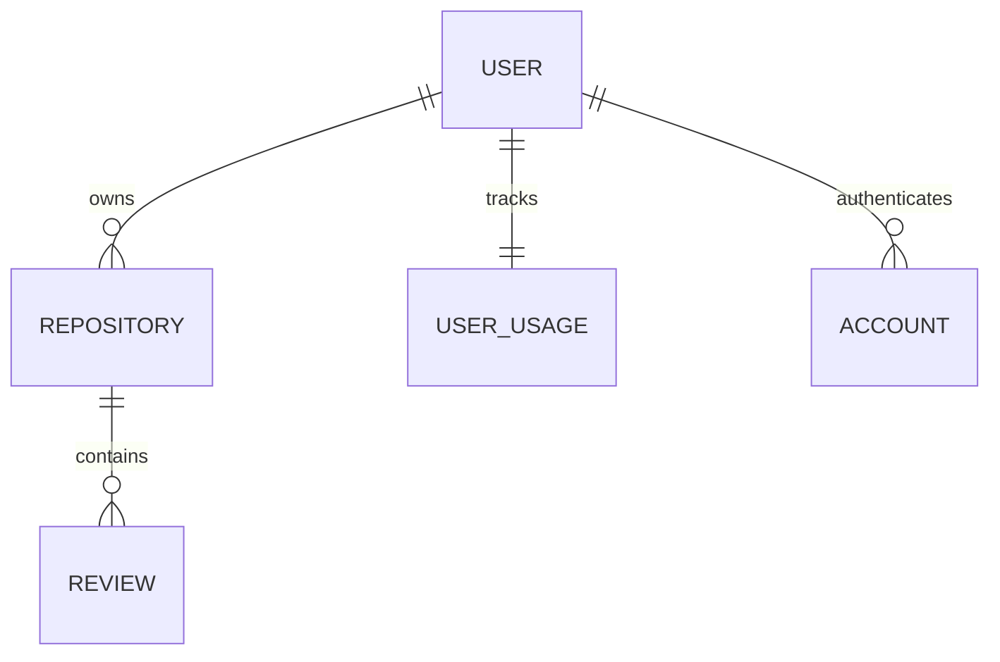

# Database Schema

Reposhield uses PostgreSQL with Prisma ORM. The schema is designed to handle multi-tenant code reviews while strictly enforcing data isolation.

## Core Models

### `User`
The central identity model. Tracks the user's basic profile, their authentication status, and their billing tier.
- **`subscriptionTier`**: Either `"FREE"` or `"PRO"`. Controls access to features.
- **`polarCustomerId`**: Links the user to their billing profile in Polar.sh.

### `Repository`
Stores metadata about every GitHub repository connected to Reposhield.
- **`githubId`**: The unique BigInt ID assigned by GitHub.
- **`fullName`**: Format: `owner/repo`.
- **`userId`**: Foreign key to the owner. All access is restricted by this ID.

### `Review`
Stores the history of every AI-generated code review.
- **`prNumber`**: The GitHub Pull Request ID.
- **`review`**: The full Markdown text generated by the AI.
- **`status`**: `completed`, `failed`, or `pending`.

### `UserUsage`
A high-performance counter table to track quotas without heavy aggregate queries.
- **`repositoryCount`**: Total number of active repos for the user.
- **`reviewCounts`**: A JSON object tracking how many reviews have been generated for each specific repository (e.g., `{"repo_123": 4}`).

## Relationships
- **User 1:N Repositories**: A user can connect multiple repos.
- **Repository 1:N Reviews**: A repository has a timeline of reviews.
- **User 1:1 UserUsage**: Every user has exactly one usage tracker.
- **User 1:N Accounts**: Better Auth manages multiple OAuth accounts (GitHub).

---

## Visual ER Diagram (Simplified)

