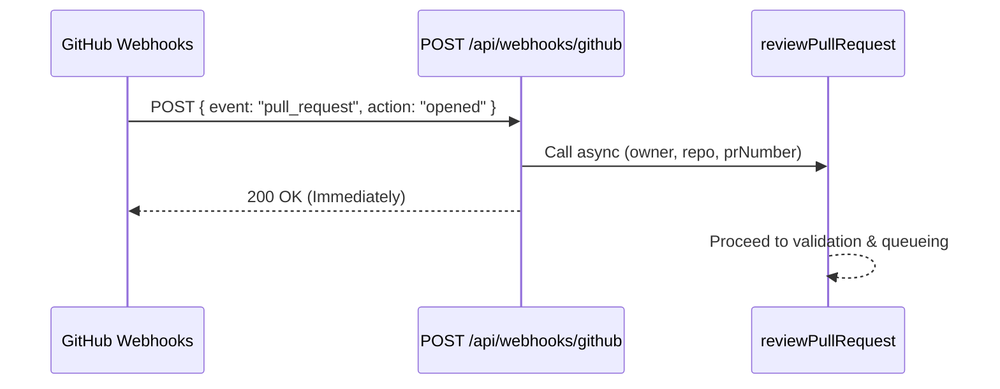
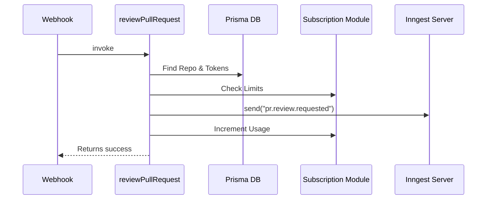
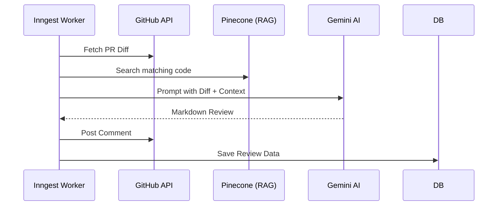
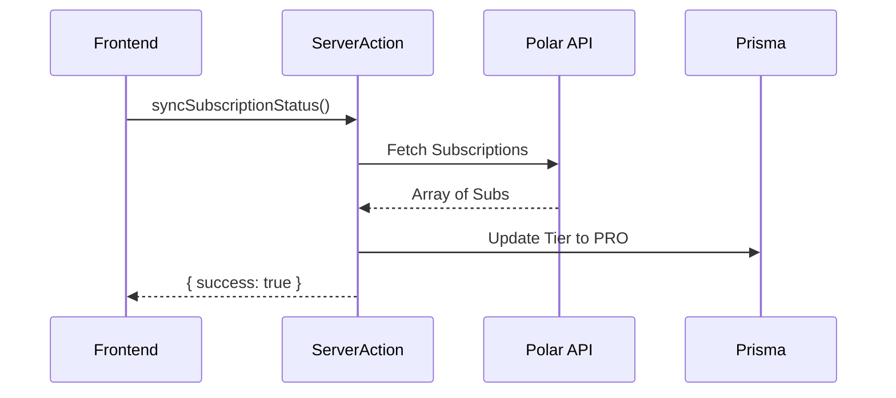
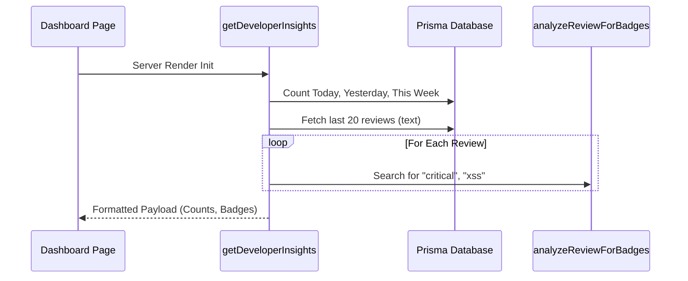

# Reposhield Execution Flow & Technical Documentation

This document provides a highly detailed, 12-point breakdown of the core business logic functions in the Reposhield architecture. It traces exactly how data flows from user actions or external webhooks into the database, through the AI processing pipeline, and back to the frontend.

---

## 1. Webhook Intake: `POST` (GitHub Webhook Handler)

### 1. Function Overview
- **Name:** `POST`
- **Location:** `app/api/webhooks/github/route.ts`
- **Purpose:** Acts as the primary entry point for all incoming GitHub Webhook events. It specifically listens for Pull Request events and triggers the AI review process.
- **Input:** Next.js `NextRequest` object containing the GitHub payload and headers.
- **Output:** Next.js `NextResponse` with HTTP status codes (200 for success, 500 for error).

### 2. Invocation Context
- **Triggered by:** GitHub's Webhook delivery system whenever an event occurs on a connected repository.
- **Entry Point:** External HTTP `POST` request to `https://<domain>/api/webhooks/github`.

### 3. Execution Flow (Step-by-step)
1. **Payload Extraction:** Awaits `req.json()` to parse the incoming GitHub webhook payload.
2. **Header Validation:** Extracts the `x-github-event` header to determine the event type.
3. **Ping Check:** If the event is `"ping"` (sent by GitHub when a webhook is first created), it immediately returns `200 OK` with `{"message": "Pong"}`.
4. **Pull Request Routing:** If the event is `"pull_request"`:
   - Extracts the `action` (e.g., `"opened"`, `"closed"`, `"synchronize"`).
   - Extracts the `repository.full_name` (e.g., `"Armaan42/reposhield"`) and splits it into `owner` and `repoName`.
   - Extracts the `number` (PR ID).
5. **Action Filtering:** Checks if the action is `"opened"` or `"synchronize"` (code pushed to an existing PR).
6. **Delegation:** If conditions are met, it asynchronously calls `reviewPullRequest(owner, repoName, prNumber)`.
7. **Response:** Returns `200 OK` with `{"message": "Event Processes"}` without waiting for the review to finish (fire-and-forget).

### 4. Function Interlinking
- **Upstream:** GitHub Webhook Service.
- **Downstream:** Calls `reviewPullRequest()` from `module/ai/actions/index.ts`.
- **Execution Sequence:** `GitHub -> POST -> reviewPullRequest`.

### 5. Data Flow Tracking
- **Data In:** Raw JSON from GitHub containing repository metadata and PR specifics.
- **Transformation:** Splits the `full_name` string into `[owner, repoName]`.
- **Data Out:** Passes primitive strings (`owner`, `repoName`) and number (`prNumber`) to downstream functions.

### 6. State & Side Effects
- **Side Effects:** Triggers a massive asynchronous chain of side effects via `reviewPullRequest`.
- **Concurrency:** Operates asynchronously but intentionally does not `await` the downstream review logic to prevent GitHub webhook timeouts (GitHub expects a response within 10 seconds).

### 7. Error Handling & Edge Cases
- **Failure Points:** Malformed JSON payloads or missing headers.
- **Exception Handling:** Wrapped in a global `try...catch`. Any unhandled error logs to the console and returns a `500 Internal Server Error`.
- **Edge Cases:** Ignores unsupported GitHub actions (like `"labeled"` or `"closed"`) by simply falling through and returning 200.

### 8. Performance Considerations
- **Time Complexity:** $O(1)$ parsing.
- **Bottlenecks:** Because it correctly avoids awaiting `reviewPullRequest`, it responds extremely fast (typically < 50ms), preventing GitHub delivery failures.

### 9. Real Execution Example
1. User pushes code to an open PR #13 on `Armaan42/reposhield`.
2. GitHub sends POST with `x-github-event: pull_request` and `action: "synchronize"`.
3. `POST` parses payload -> `owner="Armaan42"`, `repo="reposhield"`, `prNumber=13`.
4. `reviewPullRequest("Armaan42", "reposhield", 13)` is invoked.
5. Returns `200 OK`.

### 10. Visualization

### 11. Modular Breakdown
- Belongs to the **API Route layer**, acting purely as a traffic controller and data validator before handing off to the **Feature Logic Module** (`module/ai`).

### 12. Summary
This function ensures that Reposhield securely and quickly acknowledges GitHub events, cleanly separating the HTTP intake layer from the heavy backend business logic.

---

## 2. Queue Orchestrator: `reviewPullRequest`

### 1. Function Overview
- **Name:** `reviewPullRequest`
- **Location:** `module/ai/actions/index.ts`
- **Purpose:** Validates the repository state, checks user billing/subscription limits, and pushes the review job to the Inngest background queue.
- **Input:** `owner` (string), `repo` (string), `prNumber` (number).
- **Output:** Returns `{ success: true, message: "Review Queued" }` on success.

### 2. Invocation Context
- **Triggered by:** The `POST` webhook handler.
- **Entry Point:** Backend server execution.

### 3. Execution Flow (Step-by-step)
1. **Database Lookup:** Queries Prisma to find the repository matching `owner` and `name`, eagerly loading the associated `user` and their GitHub `account` credentials.
2. **Existence Check:** Throws if the repository is not found.
3. **Billing Validation:** Awaits `canCreateReview(userId, repositoryId)` to check if the user is on the PRO tier or under the FREE limit. Throws if limits are exceeded.
4. **Token Extraction:** Verifies the user's GitHub OAuth `accessToken` exists.
5. **PR Data Fetch:** Calls `getPullRequestDiff` using the Octokit client to fetch the PR title (mostly for validation).
6. **Queue Dispatch:** Uses the Inngest client to send a `pr.review.requested` event, passing `owner`, `repo`, `prNumber`, and `userId`.
7. **Limit Deduction:** Awaits `incrementReviewCount()` to update the user's quota usage.
8. **Catch Block:** If anything fails (billing, GitHub token missing), catches the error and writes a "Failed" `Review` record to Prisma to ensure the user knows why the review didn't happen.

### 4. Function Interlinking
- **Upstream:** `POST` Webhook Route.
- **Downstream:** `canCreateReview`, `getPullRequestDiff`, `inngest.send`, `incrementReviewCount`, `prisma.review.create`.
- **Execution Sequence:** `Webhook -> reviewPullRequest -> Prisma DB -> Inngest Event Queue`.

### 5. Data Flow Tracking
- **Data In:** Basic repository identifiers.
- **Transformation:** Inflates identifiers into a full database User/Repo object with OAuth tokens.
- **Side Effects:** Writes to the `UserUsage` table (increments review count). Sends a payload over HTTP to the Inngest Cloud infrastructure.

### 6. State & Side Effects
- **Global State:** Decrements user quota limits in the database. 
- **Async Behavior:** Highly asynchronous, interacting with Prisma, GitHub, and Inngest in sequence.

### 7. Error Handling & Edge Cases
- **Failure Points:** Repo not connected, user out of quota, missing GitHub token.
- **Fallback Mechanisms:** Highly resilient. The `catch` block contains an internal `try...catch` to safely attempt writing the failure state to the database without crashing the Node process.

### 8. Performance Considerations
- **Bottlenecks:** Requires 3 database queries and 1 external API call (GitHub diff) before queueing. However, because it runs decoupled from the HTTP response, these ~500ms operations do not block the user or GitHub.

### 9. Real Execution Example
1. Triggered with `("Armaan42", "reposhield", 13)`.
2. Queries DB: User is "Armaan", Tier is "FREE", usage is 2/5.
3. `canCreateReview` returns `true`.
4. Fetches GitHub token.
5. `inngest.send` pushes event.
6. DB usage increments to 3/5.

### 10. Visualization

### 11. Modular Breakdown
- Crosses boundaries between the **AI Module**, **Payment Module** (billing limits), and **GitHub Module** (tokens), acting as the central gatekeeper.

### 12. Summary
This function ensures that only authorized, quota-compliant requests are sent to the expensive AI generation layer, protecting the system from abuse and API exhaustion.

---

## 3. Background AI Processor: `generateReview`

### 1. Function Overview
- **Name:** `generateReview`
- **Location:** `inngest/functions/review.ts`
- **Purpose:** The core engine of the platform. Fetches PR code, retrieves vector context via RAG, prompts the Google Gemini AI, and posts the response to GitHub.
- **Input:** Inngest payload (`event.data`: `owner`, `repo`, `prNumber`, `userId`).
- **Output:** `{ success: true }` and writes comments to GitHub.

### 2. Invocation Context
- **Triggered by:** Inngest Event `"pr.review.requested"`.
- **Entry Point:** Executed by the Inngest worker polling mechanism.

### 3. Execution Flow (Step-by-step)
1. **Step 1: `fetch-pr-data`**: Queries Prisma for the user's GitHub token. Calls `getPullRequestDiff` to download the `.patch` string from GitHub.
2. **Step 2: `retrieve-context`**: Uses the PR `title` and `description` to query the Vector Database via `retrieveContext()`, finding the most relevant repository files to provide architectural understanding.
3. **Step 3: `generate-ai-review`**: Constructs a massive Markdown prompt containing the RAG context and the raw Code Diff. Calls the Vercel AI SDK (`generateText`) using `google("gemma-4-31b-it")` to generate the review text.
4. **Step 4: `post-comment`**: Takes the generated Markdown and pushes it to the GitHub PR timeline using `postReviewComment()`.
5. **Step 5: `save-review`**: Writes the final generated review string and metadata to the Prisma `Review` table for dashboard analytics.

### 4. Function Interlinking
- **Upstream:** `inngest.send` from `reviewPullRequest`.
- **Downstream:** `getPullRequestDiff`, `retrieveContext`, `generateText` (Gemini API), `postReviewComment`, Prisma DB.

### 5. Data Flow Tracking
- **Data Transformation:** 
  `PR IDs` -> `Code Diff` + `Vector Search Results` -> `LLM Prompt String` -> `LLM Output String` -> `GitHub Comment` & `DB Row`.

### 6. State & Side Effects
- **Concurrency:** `concurrency: 5` is set, meaning a maximum of 5 AI reviews will run simultaneously to prevent Gemini API rate limiting.
- **Resilience:** Inngest's `step.run` architecture ensures that if the Gemini API fails in Step 3, it will *retry* only Step 3, without re-downloading the GitHub diff in Step 1.

### 7. Error Handling & Edge Cases
- **Failure Points:** GitHub token revocation, Pinecone DB timeouts, Gemini rate limits.
- **Handling:** Handled entirely by Inngest's built-in exponential backoff.

### 8. Performance Considerations
- **Bottlenecks:** The `generate-ai-review` step relies on the LLM inference speed, which can take 10-30 seconds.
- **Expense:** Passing massive code diffs consumes significant LLM tokens.

### 10. Visualization

### 12. Summary
The heaviest function in the entire codebase, orchestrating third-party APIs with incredible resilience using Inngest's step-based state machine.

---

## 4. Subscription Syncer: `syncSubscriptionStatus`

### 1. Function Overview
- **Name:** `syncSubscriptionStatus`
- **Location:** `module/payment/action/index.ts`
- **Purpose:** Manually forces a synchronization between the local database and Polar.sh billing provider to accurately reflect a user's subscription tier.
- **Input:** None (uses session headers).
- **Output:** `{ success: boolean, status: string, error?: string }`.

### 2. Invocation Context
- **Triggered by:** Frontend UI (`useEffect` in `/dashboard/subscription/page.tsx` when redirected with `?success=true`).
- **Entry Point:** Next.js Server Action.

### 3. Execution Flow (Step-by-step)
1. **Auth Check:** Retrieves the current session using Better Auth. Throws if unauthorized.
2. **DB Check:** Fetches the `user` to ensure they have a `polarCustomerId`.
3. **Polar API Call:** Hits the Polar API `polarClient.subscriptions.list()` using the customer ID.
4. **Logic Evaluation:** 
   - Looks for an `'active'` subscription. If found, upgrades the user to `"PRO"` via `updateUserTier()`.
   - If no active sub exists, but a cancelled/expired one does, downgrades the user to `"FREE"`.
5. **Returns:** The updated status to the client.

### 6. State & Side Effects
- **Database Write:** Mutates the user's `subscriptionTier` and `subscriptionStatus` fields globally, affecting all future UI access and AI review quotas.

### 7. Error Handling & Edge Cases
- **Fallback Mechanism:** This acts as the fallback mechanism itself. Because webhooks can fail or be delayed, the client uses this to guarantee immediate tier updates after a successful checkout.

### 10. Visualization

---

## 5. Analytics Aggregator: `getDeveloperInsights`

### 1. Function Overview
- **Name:** `getDeveloperInsights`
- **Location:** `module/dashboard/actions/insights.ts`
- **Purpose:** Aggregates historical AI reviews, calculates growth trends, maps keywords to UI badges, and returns formatted data for Recharts graphing.
- **Input:** None (relies on session state).
- **Output:** JSON object containing review counts, daily chart arrays, and earned badges.

### 3. Execution Flow (Step-by-step)
1. **Time Normalization:** Calculates UTC boundaries using `new Date()`, `setUTCHours(0,0,0,0)`, ensuring timezone agnosticism.
2. **Querying:** Runs multiple Prisma `count` queries to find reviews for today, yesterday, last week, and the week before.
3. **Data Formatting (Loop):** Iterates over the last 7 days, mapping dates to weekday names ("Mon", "Tue") and injecting zero-counts to ensure charts render correctly even on days with 0 activity.
4. **Trend Math:** Calculates percentage growth: `((thisWeek - lastWeek) / lastWeek) * 100`. Handles division by zero gracefully.
5. **Badge Processing:** Loops through the raw text of the 20 most recent reviews. Passes text to `analyzeReviewForBadges()`, which runs keyword `.includes()` checks to detect "Production Hazards" or "Security Guardians".
6. **Return:** Bundles everything into a single payload for the UI.

### 8. Performance Considerations
- **Bottlenecks:** Multiple sequential Prisma queries. As the `Review` table grows, running `count` queries without indexes on `createdAt` and `userId` will slow down page load times.
- **Memory:** `analyzeReviewForBadges` loads entire text blobs into memory to scan keywords. For 20 reviews, this is fine, but scanning 100+ would block the Node event loop.

### 10. Visualization

### 12. Summary
A complex data transformation function that sits cleanly between raw relational data and the visual presentation layer, powering the entire gamification loop of the Reposhield platform.
